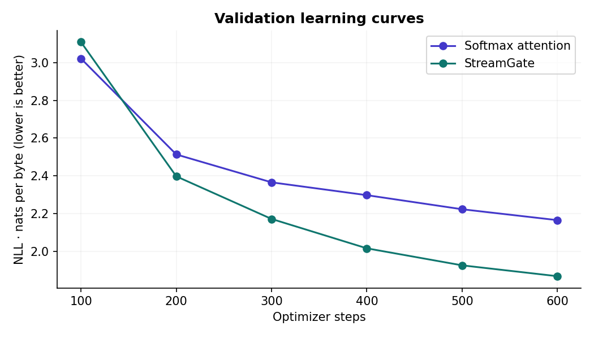
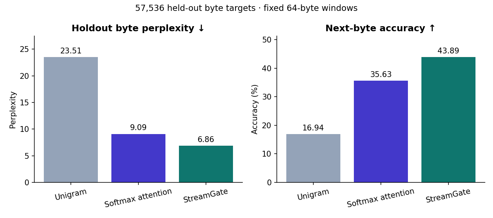
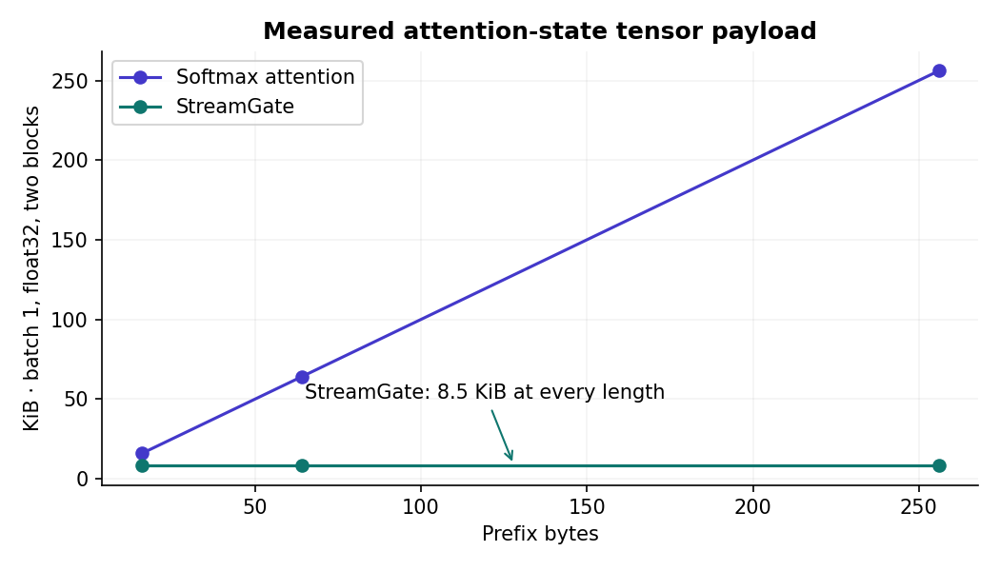
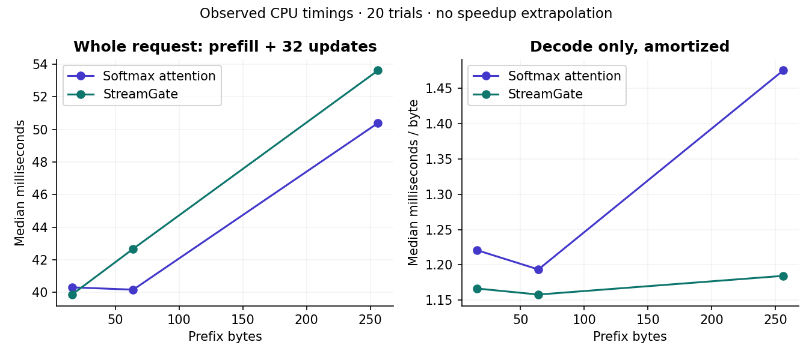
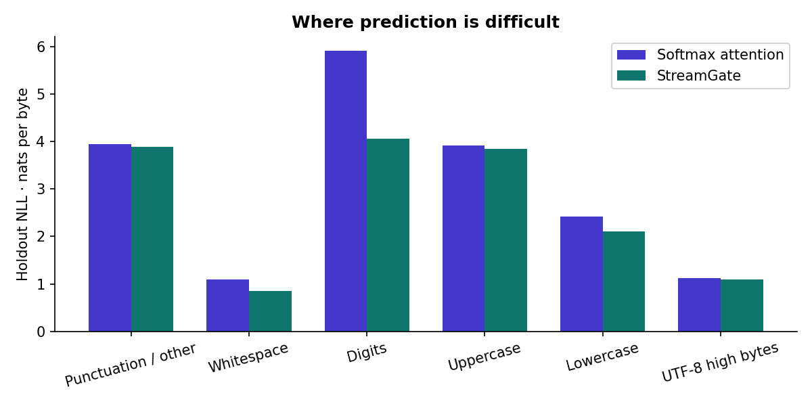
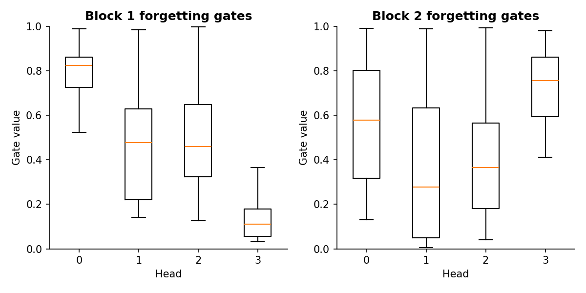

# StreamGate-TF

A TensorFlow byte decoder that trades a growing attention cache for a fixed-size, learned-gate recurrent state.

---

## Overview

* **Task:** Autoregressive byte language modeling and streaming inference engineering.
* **Dataset:** 575,793 UTF-8 bytes from *The Adventures of Sherlock Holmes*, with a fixed vocabulary of 256 byte IDs.
* **Selected Model:** **StreamGate**, selected on full-validation NLL; holdout byte perplexity **6.8628**.
* **Baseline Comparison:** Standard softmax attention reached **9.0866** perplexity; the training-only unigram baseline reached **23.5051**.
* **Engineering Result:** Attention-state payload is **8.5 KiB** regardless of prefix length. At 64 bytes, this is **86.7% less** than the softmax model's 64 KiB KV cache. Whole-request CPU latency was higher at 64- and 256-byte prefixes.

---

## Architecture

**Question:** Can a learned-gate positive-kernel decoder replace growing KV storage with fixed-size recurrent state while retaining useful byte prediction quality?

Each model has two pre-normalized blocks, width 64, four attention heads, a 128-wide GELU feed-forward layer, fixed sinusoidal positions, and tied input/output embeddings. There are no pretrained weights, LLM API calls, or built-in attention wrappers. TensorFlow provides tensor operations, dense layers, normalization, automatic differentiation, and Adam.

For each head, StreamGate transforms queries and keys with `φ(x) = (ELU(x) + 1) / √d`. A sigmoid projection of the normalized input produces a scalar forgetting gate `g` for that head:

$$S_t = g_t S_{t-1} + \phi(k_t)v_t^\top$$

$$z_t = g_t z_{t-1} + \phi(k_t)$$

$$o_t = \frac{\phi(q_t)^\top S_t}{\max(\phi(q_t)^\top z_t, 10^{-6})}$$

The state contains one `d × d` matrix and one `d` vector per head. The current token participates in attention, as in the causal softmax comparator. State starts at zero for each evaluation window or new session. Streaming updates return new tensors; no request state is stored inside model weights.

This is an original implementation of established kernel-attention ideas with a simple learned forgetting gate. It does **not** introduce a new attention algorithm or reproduce a specific GLA paper. The motivating recurrence is credited to [Katharopoulos et al., *Transformers are RNNs*](https://proceedings.mlr.press/v119/katharopoulos20a.html).

Training uses `tf.scan` and materializes intermediate recurrent states for differentiation. **Fixed-size inference state does not imply constant-memory training.** The prefill implementation is sequential; it does not implement a parallel associative scan or fused GPU kernel.

---

## Key Results

Training completed on **5 October 2026, Riyadh time**. Both models saw the same **614,400 sampled byte targets**, in the same order: 600 optimizer steps, batch 16, context 64, seed 42. Adam used learning rate 0.001 and global gradient clipping at 1.0. The gate adds 520 parameters, so the comparison holds width and token budget fixed rather than exact parameter count or wall-clock compute.

### Validation Selection

| Model | Parameters | Selected step | Full-validation NLL ↓ | Validation perplexity ↓ |
| :--- | ---: | ---: | ---: | ---: |
| **StreamGate** | **83,464** | **600** | **1.8876** | **6.6037** |
| Softmax attention | 82,944 | 600 | 2.1759 | 8.8097 |

Checkpoints were evaluated every 100 steps on 128 fixed validation windows. The lowest selection-window NLL chose each checkpoint; full validation then chose the architecture. Test data was unused for these decisions. There is no cross-validation or fold SD: this experiment uses a contiguous train/validation/test split.

### Final Holdout Evaluation — 57,536 Byte Targets

| Model | Perplexity ↓ | Bits per byte ↓ | Next-byte accuracy ↑ |
| :--- | ---: | ---: | ---: |
| **StreamGate** | **6.8628** | **2.7788** | **43.89%** |
| Softmax attention | 9.0866 | 3.1837 | 35.63% |
| Training-only unigram | 23.5051 | 4.5549 | 16.94% |

Perplexity is `exp(mean byte NLL)`, not word perplexity. The two models trained once with one fixed seed. This is evidence about this small corpus and training budget, not a general ranking of attention architectures. Unigram probabilities use add-one-smoothed training byte counts.

### Streaming State and CPU Latency

Each request prefills the stated prefix, then consumes 32 teacher-forced bytes at batch size one. Reported medians use 20 trials following three warmups; streaming and repeated-full execution order alternates. The recorded benchmark ran without the checkpoint verification process running alongside it.

| Prefix | Softmax state | StreamGate state | Softmax request | StreamGate request |
| :--- | ---: | ---: | ---: | ---: |
| 16 bytes | 16 KiB | **8.5 KiB** | 40.31 ms | 39.87 ms |
| 64 bytes | 64 KiB | **8.5 KiB** | 40.17 ms | 42.67 ms |
| 256 bytes | 256 KiB | **8.5 KiB** | 50.39 ms | 53.61 ms |

State sizes above are measured immediately after prefill. After the 32 updates, softmax state grows by another 32 KiB; StreamGate stays at 8.5 KiB. The float32 payload formulas are `L × H × (d² + d) × 4` for StreamGate and `2 × L × T × H × d × 4` for softmax. Actual tensor sizes matched both formulas at all measured lengths.

Timing includes prefill, Python state orchestration, and materialized logits. It excludes checkpoint loading, graph tracing, tokenization, and sampling. It is a CPU workload with two TensorFlow intra-op and two inter-op threads, not an isolated attention-kernel or GPU comparison. State payload excludes weights, the position counter, activations, graph storage, and allocator overhead.

**There is no consistent whole-request CPU speed advantage.** StreamGate prefill at 256 bytes took a median 16.56 ms, versus 3.35 ms for softmax; the scan is a bottleneck. Its measured decode-only time was approximately 1.16–1.18 ms per byte. Training, including selection and tracing, took 29.34 seconds versus 10.47 seconds for softmax.

The models trained on 64-byte windows. The 256-byte workload measures systems scaling and parity; it does not establish useful prediction quality at long contexts. Both paths process the entire prefix without sliding-window eviction.

---

## Data Summary

* **Source:** [The Adventures of Sherlock Holmes, Project Gutenberg #1661](https://www.gutenberg.org/ebooks/1661), by Arthur Conan Doyle. The catalog identifies the book as public domain in the USA.
* **Verification:** All 607,606 original source bytes matched a fresh download. Source and processed-body SHA-256 hashes are recorded in `data/manifest.json`.
* **Processing:** Strict UTF-8 decoding, normalized line endings, Gutenberg header/footer removal at explicit markers, and outer-whitespace trimming. Internal text and the contents list are preserved. No deduplication or missing-value imputation.
* **Split:** 460,634 training, 57,579 validation, and 57,580 test bytes, contiguous by byte offset. No window crosses a split boundary. Byte IDs are fixed in advance and require no vocabulary fitting.
* **Evaluation:** 899 non-overlapping target windows per held-out split, each with 64 targets. Inputs share the transition byte between adjacent windows; target sets are disjoint. Remaining tail targets are excluded and counted by the split/window totals.
* **Features / Collinearity:** Tabular feature importance and correlation analysis do not apply to this architecture experiment. Learned-gate and byte-category diagnostics are provided instead.

The full book is downloaded during preparation and excluded from the repository. Checkpoints, the exact training-window plan, per-target holdout predictions/losses, and evaluation start offsets are included. `runs/verification.json` records a successful fresh-source checkpoint replay of both validation and holdout scores.

---

## Error Analysis and Checks

`error_analysis.csv` records every held-out window's loss, accuracy, and wrong-byte count. `runs/error_analysis.json` contains each model's ten highest-loss windows with decoded context. `runs/error_by_byte_group.csv` separates uppercase, lowercase, whitespace, digits, high UTF-8 bytes, and other punctuation.

The models learn short spelling and dialogue patterns, but the generated samples contain broken words and inconsistent sentences. They are small byte models, not instruction-tuned assistants. Byte-level errors and perplexity do not measure factual accuracy or reasoning.

Seven architecture tests passed, including an independent NumPy weighted-attention equation, future-token causality, full-sequence versus token-step and chunked execution, request-state isolation, payload formulas, and rejection of multi-token input to the one-step API. On both trained checkpoints and all three measured prefixes, every greedy prediction matched the full-sequence path. The largest absolute logit difference was **3.34 × 10⁻⁶**. This is numerical agreement within tolerance, not bit-identical arithmetic.

---

## Visualizations

| Validation learning curves | Holdout prediction quality |
| :---: | :---: |
|  |  |

| Measured state payload | Measured CPU latency |
| :---: | :---: |
|  |  |

| Prediction errors by byte category | Learned forgetting gates |
| :---: | :---: |
|  |  |

---

## Reusable Components

`GatedLinearAttention` can be used independently with continuous hidden states. `ByteDecoder` exposes full-sequence, chunked-prefill, and one-token update paths. `StreamingEngine` loads the included checkpoints; each `ByteSession` owns its state and position counter. The command-line generator works locally without an API key.

See [USAGE.md](USAGE.md) for the layer interface and generation CLI, and [EXPERIMENT.md](EXPERIMENT.md) for execution and verification commands.

---

## Repository Structure

```text
├── streamgate/              # Attention, decoder, data, and streaming session code
├── checkpoints/             # Both selected TensorFlow weight snapshots as NPZ
├── figures/                 # Six charts derived from executed outputs
├── runs/                    # Window plan, predictions, timings, errors, verification
├── data/manifest.json       # Public-source attribution, split offsets, and hashes
├── tests/                   # Equation, causality, chunking, and isolation checks
├── analysis.ipynb           # Interactive results and streaming-state walkthrough
├── audit.json               # Environment, execution timestamp, and run hashes
├── error_analysis.csv       # Window-level errors for both checkpoints
├── metrics.json             # Full validation and holdout scores
├── config.json              # Predeclared seed, architecture, and training budget
├── train.py                 # Equal-token-budget experiment
├── benchmark.py             # CPU timings and trained-checkpoint parity
├── verify.py                # Fresh-source checkpoint replay
├── report.py                # Diagnostic tables and figures
├── generate.py              # Local streaming generation CLI
├── USAGE.md                 # Component API and CLI examples
├── EXPERIMENT.md            # Experiment execution details
├── LEARNING_NOTES.md        # Unfilled human review prompts
├── requirements.txt         # Pinned direct dependencies
└── README.md
```

Code and weight artifacts are MIT licensed; the source book retains its own public-domain status and Gutenberg terms. Implemented and executed with OpenAI Codex assistance for Saud Alotaibi. Human learning notes remain unfilled.
